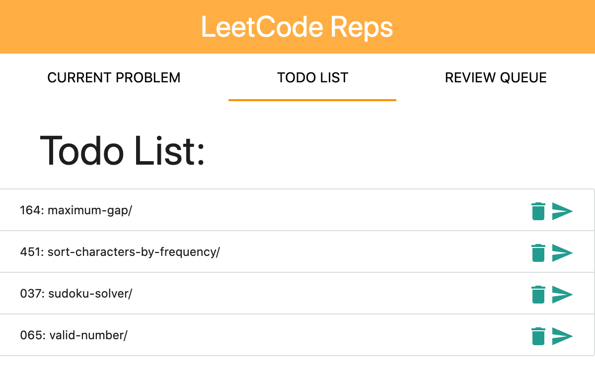

# LeetCode Assistant

A chrome extension improves users'
experience on `leetcode.com`.

## Getting Started

### Manual/Development

1. Clone this repo.
2. In Chrome, open the Extensions settings. (Wrench button, Tools, Extensions.)
3. On the Extensions settings page, click the "Developer Mode" checkbox.
4. Click the now-visible "Load unpacked extension…" button. Navigate to the directory where you cloned the repo, then the src directory under that.
5. The Markdown Here extension should now be visible in your extensions list.
6. Reload your webmail page (and maybe application) before trying to convert an email.

## Pop-up Page

A pop-up page is displayed under

```
https://leetcode.com/problems/*
```

, which allows user to view infomation and do operate of specific problem.

### Current Problem Tab

The current Problem tab is the default tab.

The frequency and AC rate
was captured and displayed so that the user doesn't have to find them at
another page.

The attempts of the current problem were recorded, and the user
can decide if the problem is successfully solved this time. This is better than fetch your own ac rate from submissions since some problems may be generally simple but with a lot of strange corner cases.

Users can add a current problem to a todo list or review queue, which can be viewed by clicking their respective tabs. This is supplementary to the current leetcode's add-to-list.


#### Markdown Generation

By clicking the **DOWNLOAD** button,
a markdown note of the current problem would be generated and saved. File-name would be in the format of

```
leetCode-number-title.md
```

This file will store the problem description and your current solution code by manipulating
current tab's DOM.

**For a demo note, see**
[037. Sudoku-Solver](leetCode-037-Sudoku-Solver.md)

By clicking the **copy MD** button, the current problem's URL is copied to the clipboard as a markdown link.
For example,

[037: Sudoku-Solver](https://leetcode.com/problems/sudoku-solver/)

```
[037: Sudoku-Solver](https://leetcode.com/problems/sudoku-solver/)
```

By clicking the **copy gitbook** button, a markdown link of the current problem's markdown note file is copied to clipboard. This is in order to provide an easier way to make SUMMARY file of gitbook. For example,

[037. Sudoku-Solver](leetCode-037-Sudoku-Solver.md)

```
[037. Sudoku-Solver](leetCode-037-Sudoku-Solver.md)
```

### Todo List Tab

This is a lightweight todo list, which is to help save problems that you'd like to solve recently, rather than leaving a lot of tabs open in the browser. The Todo list does not accept a duplicate problem. You can remove/redirect-to specific problems by clicking the respective buttons.



### Review Queue

Once a problem is added to the review queue, it will be reviewed at least five times. For each date, the review queue won't have duplicate problems, but you can still add the problem to those dates that the current problem is not present.
You can remove/redirect-to specific problems by clicking the respective buttons.


## Feedback

All bugs, feature requests, issues, pull requests, feedback, etc., are welcome.

## License

MIT License: http://adampritchard.mit-license.org/
